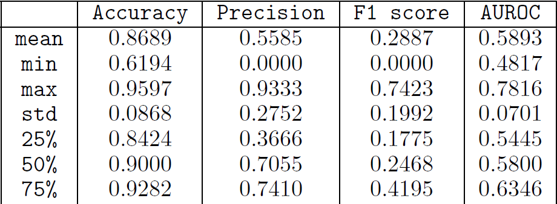

<h1 align="center">Gene Prediction using Centrality Measures</h1>

This project was done as part of the coursework for the _BT5240 - Computational Systems Biology_ in the Jan - May 2021 Semester at IIT Madras under Prof. Karthik Raman. 

Using the centrality measures and recursively extracted features from organisms' Protein-Protein interaction networks, essential genes of the organism were predicted. The results were then used to contemplate the Centrality-Lethality hypothesis in the context of Gene prediction.

The data was used from the <a href="https://string-db.org/" title="STRING">STRING</a> and <a href="https://www.ncbi.nlm.nih.gov/pmc/articles/PMC308758/" title="DEG">DEG</a> databases. All references have been mentioned in the <a href="https://github.com/nanthamanish/GeneCentralityLethality/blob/main/Report/Centrality%20Lethality%20in%20the%20context%20of%20Essential%20Gene%20Prediction.pdf" title="report">report</a> on the project. 

Amongst the 27 organisms used to predict the essential genes via leave one out validation, a **mean accuracy of 0.8689** and a **mean AUROC score of 0.5893** was achieved.

## Dataset:
The dataset for this project can be downloaded from this <a href="http://www.plosone.org/article/fetchSingleRepresentation.action?uri=info:doi/10.1371/journal.pone.0208722.s001" title="link">link</a>, rename the folder extracted from the zip file to ```Graphs/``` and place it in the current working directory to extract features.

## Feature Extraction:
```graphs.txt``` contains the list of organisms in the dataset, so if you choose to run on a larger or smaller dataset, adjust the file accordingly. 
+ To extract the centrality measures, run ```features.py```
+ To extract recursive features from the graph, run ```ReFeX.py```

**Note:** The extraction for the dataset used for the project has been performed already and provided in the ```Features.zip``` and ```ReFeX.zip``` files. These can directly be used for evaluation as well.

## Prediction and Evalution:
```Predict_Evaluate.py``` predicts genes and calculates stats using the XGboost package and uses leave one out validation.

To run this, store all feature extracted files in the form ```Features/feat_<taxonomical id>.csv``` and the essential genes in the form ```EssGenes/ess_<taxonomical id>.csv```. The ReFeX features selected for prediction are alone to be appended to each feature file.

## Results:
The results obtained when run on the database are as follows:
<p align=center>
  
</p>
